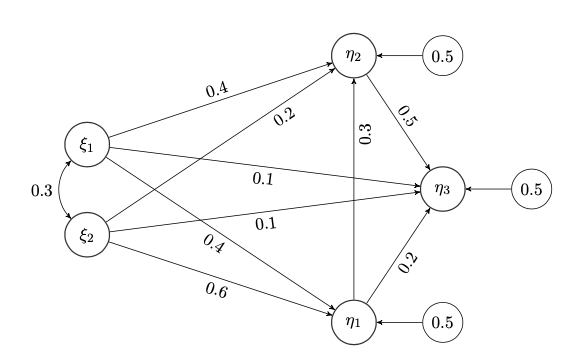

```{r, include = FALSE}
knitr::opts_chunk$set(
  collapse = TRUE,
  comment = "#>"
)
knitr::opts_chunk$set(warning = FALSE, message=FALSE, error=TRUE, purl=FALSE, cache=TRUE)

knitr::opts_chunk$set(dpi=100)
```


The covsim package includes three methods for simulating non-normal data from distributions with given covariance matrix. The most flexible method is VIne-To-Anything (VITA) (@gronneberg2017covariance), and its implementation and use in covsim is explained in @jss. VITA allows complete specification of the marginal distributions, and partial specification of bivariate dependencies.

In addition to VITA, two more simple methods are available in covsim, which allows specification of univariate skewness and kurtosis. The independent generator (IG) was proposed by @foldnes2016simple, while the piecewise linear approach (PLSIM) was proposed by @foldnes2021plsim. 


# VITA

The function vita() returns a regular vine object as defined by package rvinecopulib (@rvinecopulib).  
This object may be used to simulate data from the corresponding vine distribution. 
The function takes a list of marginal distributions and a covariance matrix as essential input. 
In addition, the user may provide details on the vine structure and the bivariate copulae to be considered at each node in the vine. 

## Bivariate case

Let us first consider the bivariate case, where we want a distribution with standard normal marginals coupled by a Clayton copula, whose correlation is $\rho=.8$
```{r}
library("covsim")
mnorm <- list(list(distr = "norm"), list(distr = "norm"))
sigma.target <- matrix(c(1, 0.8, 0.8, 1), 2)
set.seed(1)
calibrated.vita <- vita(mnorm, sigma.target, family_set = "clayton")
summary(calibrated.vita)
```

The calibrated vita object is made from a Clayton copula with dependence parameter $\theta=3.4$. 
You can confirm that the vine distribution has correlation $\rho=.8$, by simulating a $n=10^5$ sample from the vita object: 


```{r}
```{r eval=F}
library("rvinecopulib")
large.sample <- rvine(10^5, calibrated.vita)
cov(large.sample)
```

## Trivariate case

The motivation for this example is given in @jss, and we here restrict ourselves to calibration of the vita object. Our target covariance matrix is
$$ \Sigma =  \begin{pmatrix}   1 & 0.4 & 0.3 \\ 
  0.4 & 1 & 0.4 \\ 
  0.3 & 0.4 & 1 \\  \end{pmatrix},   $$
and we want the marginals to be the standard
normal distribution,  a scaled chi-squared
distribution with one degree of freedom, and a scaled Student's $t$ distribution with five DFs.
The scalings ensure unit variance. In addition, we want to specify the vine structure explicitly, and also the copula family for each bivariate dependency as follows.
Note: We set Nmax=10^5 to speed things up, the default, Nmax=10^6 should be used for serious work.

```{r, out.width="75%"}
sigma.target <- matrix(c(1, 0.4, 0.3, 0.4, 1, 0.4, 0.3, 0.4, 1), 3)
margins <- list(list(distr = "norm"), list(distr = "chisq", df = 1), 
                list(distr = "t", df = 5))
pcs <- list(list(bicop_dist("clayton"), bicop_dist("joe")),
            list(bicop_dist("frank")))     
vine_cop <- vinecop_dist(pcs, structure = dvine_structure(1:3))
margin.variances <- c(1, 2, 5/3)
pre <- diag(sqrt(margin.variances/diag(sigma.target)))
vita.target <- pre %*% sigma.target %*% pre
set.seed(1)
calibrated.vita <- vita(margins, vita.target, vc = vine_cop, 
                        verbose = TRUE, Nmax = 10^5)#FAST CALIBRATION
post <- diag(1/diag(pre))
vita.sample <- rvine(10^5, calibrated.vita) %*% post
round(cov(vita.sample) - sigma.target, 3)
library(GGally)
GGally::ggpairs(data.frame(head(vita.sample, 2*10^3)))
```

Note that if the vc option is not included in the vita() call, the default will be the simple structure given by a d-vine. The copula families in each node (each bivariate association) may be specified by option family_set, where the default ensures that first a Clayton copula is tentatively calibrated. If unsuccesful, next a gauss, joe, gumbel or frank copula are calibrated, in that order. If none of these families can produce the required covariance, vita() returns an error message indicating that no vine distributional class can match the given marginals and covariance matrix.

## SEM example in 20 dimensions

 


```{r }
sem.pop <- 'Ksi1 =~ start(.8)*x1 +start(.7)*x2 +start(.6)*x3 +start(.5)*x4
Ksi2 =~ start(.8)*x5 + start(.7)*x6 + start(.6)*x7 +start(.5)*x8
Eta1 =~ start(.8)*y1 + start(.7)*y2 + start(.6)*y3 +start(.5)*y4
Eta2 =~ start(.8)*y5 + start(.7)*y6 + start(.6)*y7 +start(.5)*y8
Eta3 =~ start(.8)*y9 + start(.7)*y10 + start(.6)*y11 +start(.5)*y12
Eta1 ~ start(.4)*Ksi1 + start(.6)*Ksi2
Eta2 ~ start(.4)*Ksi1 + start(.2)*Ksi2 + start(.3)*Eta1
Eta3 ~ start(.1)*Ksi1 + start(.1)*Ksi2 + start(.2)*Eta1 +start(.5)*Eta2
Ksi1 ~~ start(.3)*Ksi2; Eta1 ~~ start(.5)*Eta1;
Eta2 ~~ start(.5)*Eta2; Eta3 ~~ start(.5)*Eta3 
x1 ~~ start(.5)*x1; x2 ~~ start(.5)*x2
x3 ~~ start(.5)*x3; x4 ~~ start(.5)*x4; x5 ~~ start(.5)*x5 
x6 ~~ start(.5)*x6; x7 ~~ start(.5)*x7; x8 ~~ start(.5)*x8 
y1 ~~ start(.5)*y1; y2 ~~ start(.5)*y2; y3 ~~ start(.5)*y3
y4 ~~ start(.5)*y4; y5 ~~ start(.5)*y5; y6 ~~ start(.5)*y6
y7 ~~ start(.5)*y7; y8 ~~ start(.5)*y8; y9 ~~ start(.5)*y9
y10 ~~ start(.5)*y10; y11 ~~ start(.5)*y11; y12 ~~ start(.5)*y12'
library(lavaan)
sigma.target <- lavInspect(sem(sem.pop, data = NULL), "sigma.hat")
```

Next, we fit a VITA distribution with normal marginals to the target
covariance matrix. This is a variant of a data generating distribution
used in the simulation study of @foldnes2021plsim.  First, the
margins are scaled to match the target variances. Then, we calibrate a
VITA distribution. Note that we do not specify which family of copulae
to use, so the default Clayton copula is used. Finally, a list of 1000
samples, each of sample size 1000, is drawn from the calibrated vita
distribution.
```{r eval=F}
marginsnorm <- lapply(X = sqrt(diag(sigma.target)), 
                      function(X) list(distr = "norm", sd = sqrt(X)))
vitadist <- vita(marginsnorm, sigma.target)
randomsamples <- replicate(10^3, rvine(10^3, vitadist))
```

		
The above calibration step is time-consuming, since it is high-dimensional.
With 20 variables, the calibration step
required 1.8 hours (again using a 2.3 GHz 8-Core Intel Core i9
CPU). This step is only performed once.  When completed, random
samples can be drawn at a relatively fast rate. Producing 1000 samples
each of size 1000 took one minute to complete.  Finally, we note that
the calibration step may be performed faster by specifying option
Nmax=$10^5$ when calling \fct{vita}, at the expense of
reduced precision in covariance matching.


## Ordinal-categorical data 

We assume that the underlying correlation in a
continuous bivariate distribution with standard normal marginals is
$\rho=0.5$, and we discretize into three categories using thresholds
$\tau_1=0$ and $ \tau_2=1$. This means that we consider simulated data
of the form
\[
  X_i = 
  \left\{  \begin{matrix}
      1, & \text{if } \xi_i \leq \tau_1 \\
      2, & \text{if } \tau_1 < \xi_i \leq \tau_2 \\
      3, & \text{if } \xi_i > \tau_2 \\
    \end{matrix}
  \right. 
  =
  \left\{  \begin{matrix}
      1, & \text{if } \xi_i \leq 0 \\
      2, & \text{if } 0 < \xi_i \leq 1 \\
      3, & \text{if } \xi_i > 1 \\
    \end{matrix}
  \right. 
\]
for $i=1,2$, where $(\xi_1,\xi_2)$ is a continuous random vector
simulated using VITA.  Both ordinal variables have proportions
$0.5, 0.34,$ and $0.16$. We inquire whether the polychoric correlation
estimator used in ordinal SEM becomes biased when we replace the
bivariate normal with a Clayton or a Joe copula. So first, we
determine parameters for the latter two copulas such that, when
marginals are standard normal, the Pearson correlation is $0.5$.
We then discretize a large sample from each of the VITA distributions and estimate the polychoric correlation. 
The estimates turn out to be very biased:

```{r }
sigma.target <- matrix(c(1, 0.5, 0.5, 1), 2)
set.seed(1)
vita_clayton <- vita(list(list(distr = "norm"), list(distr = "norm")), 
                     sigma.target, family_set = "clayton")
set.seed(1)
vita_joe <- vita(list(list(distr = "norm"), list(distr = "norm")), 
                 sigma.target, family_set = "joe")
clayton.disc <- apply(rvine(10^5, vita_clayton), 2, cut, 
                      breaks = c(-Inf, 0, 1, Inf), labels = FALSE)
joe.disc <- apply(rvine(10^5, vita_joe), 2, cut, 
                      breaks = c(-Inf, 0, 1, Inf), labels = FALSE)
library(psych)
#polychoric correlation (based on underlying normality) is severely biased (downards for Clayton, and upwards for Joe)
polychoric(clayton.disc)$rho
polychoric(joe.disc)$rho

```


# IG and Piecewise linear methods

The IG and PLSIM methods require just specifying the kurtosis and skewness of each marginal distribution, together with the covariance matrix. Hence, the marginals are not fully controlled, in contrast to VITA. 

Let us require skewness=2 and excess kurtosis =7 in each of three marginal distributions. 
The covariance matrix is specified as
$$ \Sigma =  \begin{pmatrix}   1 & 0.4 & 0.3 \\ 
  0.4 & 1 & 0.4 \\ 
  0.3 & 0.4 & 1 \\  \end{pmatrix},   $$
  

## IG
Function rIG() returns a list of simulated samples, of length specified by option reps. 
The default is reps=1 (one sample only), so we need to append [[1]]:
  
```{r}
skewness=rep(2, 3)
excesskurtosis=rep(7,3)
sigma.target <- matrix(c(1, 0.4, 0.3, 0.4, 1, 0.4, 0.3, 0.4, 1), 3)
set.seed(1)
ig.sample <- rIG(10^4, sigma.target, skewness, excesskurtosis )[[1]]
round(cov(ig.sample)-sigma.target,3)
psych::skew(ig.sample)
psych::kurtosi(ig.sample)

```
## PLSIM


The piecewise linear approach is run similarly:
```{r}
set.seed(1)
pl.sample <- rPLSIM(10^4, sigma.target, skewness, excesskurtosis )[[1]]
pl.sample <- data.frame(pl.sample)
round(cov(pl.sample)-sigma.target,3)
psych::skew(pl.sample)
psych::kurtosi(pl.sample)

```

Note that rPLSIM() is slower that rIG(), since it requires numerical optimization for each pair of variables. 
The distributions stemming from PLSIM are different from the IG distributions, even if the covariance matrix and the marginal skewness and kurtosi are identical. 


```{r, out.width="75%"}
GGally::ggpairs(data.frame(ig.sample)[2:10^3,])
GGally::ggpairs(data.frame(pl.sample)[2:10^3,])

```


# References


